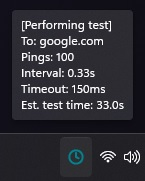

# PingTest
PingTest is a clean, lightweight system tray app that monitors your internet connection quality using colored icons and data. It employs multithreading for continuous background ping tests, updating the system tray icon with real-time results. Users can customize the ping test, changing the host, amount of pings, and other settings to tailor the monitoring to their specific needs.  
The ping test is easily customizable through the settings options available in the context menu of the system tray icon.

## Screenshots
The system tray icon changes color based on connection stability:

&nbsp;
&nbsp;
&nbsp;
&nbsp;&nbsp;

Colors represent different packet loss percentages: blue (<9%), green (<18%), yellow (<28%), and red (>=28%).  
Through the settings window, you can customize each threshold to your preference.  
The clock icon appears initially, awaiting results.

## Installation

1. Download the .exe from the [Releases](https://github.com/GenaroDS/PingTester.NET/releases/tag/exe) section.
2. Run `PingTester.exe`. 
   - Note: The first time you run the application, it might take a moment to initialize.

## Conclusion
PingTest allows you to effortlessly monitor your internet connection's stability, identifying potential issues while you use your computer normally.

